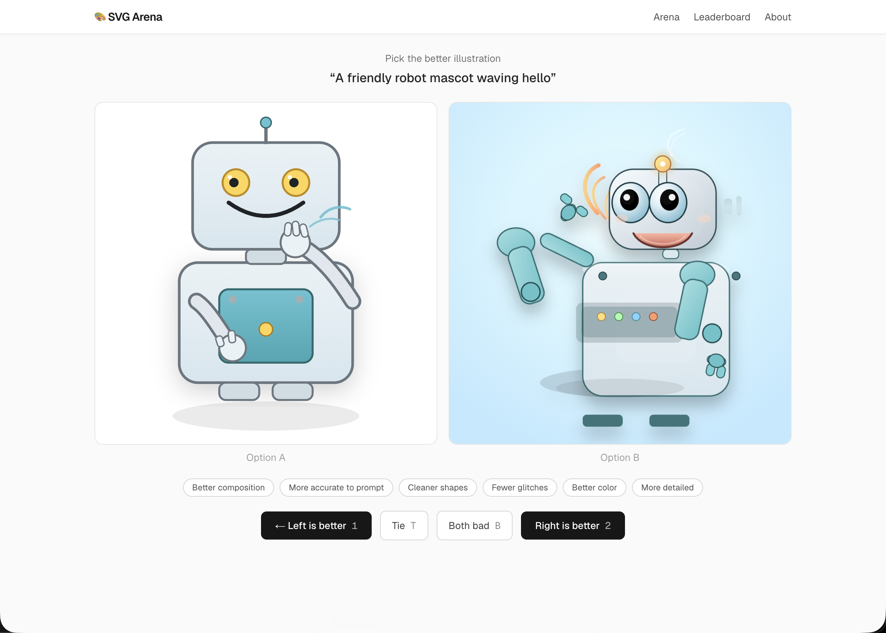

# SVG Arena

A complete, forkable example of the **human-in-the-loop model-improvement loop**: an AI generates outputs, real people judge them (recruited on demand through the [Terac](https://terac.com) MCP), and you turn those judgments into a measurably better model, then prove it with a before/after human eval.

This example is an **SVG illustration arena**. The same prompt is drawn by competing models or prompts, people vote blind on which result is better, and you get a live Bradley-Terry leaderboard plus an exportable human-preference dataset. It was built as a reference for the Terac hackathon track, but the pattern works for anything a layperson can judge: TTS naturalness, ad copy, summaries, UI layouts, and so on.

**Live demo:** https://svg-arena.vercel.app



---

## The loop

```
generate candidates  ->  humans judge them via Terac  ->  train / rerank  ->  held-out before/after on Terac
        ^                                                                              |
        +------------------------------ iterate -------------------------------------+
```

The arena you build is the cheap, swappable part. The valuable part is clean human signal, collected fast and in a loop. Optimize for the signal.

---

## What's in here

- A blind **pairwise voting arena** (Next.js App Router + Postgres) with reason tags and identity reveal after each vote.
- An offline **generation pipeline** with a pluggable provider abstraction (OpenAI and Anthropic included).
- **Server-side SVG sanitization**, **signed pairing tokens** (anti-tamper), and built-in **calibration / attention checks**.
- **Per-participant attribution** captured from Terac's task-URL params (the integration detail you must not miss).
- **Bradley-Terry** ranking (order-independent, unlike sequential Elo) and a **JSONL preference-dataset export**.
- A **held-out test split** so your final before/after eval is credible.

---

## Quickstart

**Prerequisites:** Node 20+, a Postgres database (the [Neon](https://neon.tech) or Vercel Postgres free tier is perfect), and an OpenAI or Anthropic API key.

```bash
git clone https://github.com/TeracAI/svg-arena
cd svg-arena
npm install

cp .env.example .env.local         # then fill in DATABASE_URL, SESSION_SECRET, and a model key

npm run db:migrate                 # apply the schema
npm run seed                       # load the competitors + prompt set
npm run generate                   # generate the SVGs (calls your model key; idempotent)

npm run dev                        # http://localhost:3000
```

`npm run generate` is the only step that calls a model API. The web app never does; it only reads pre-generated outputs from the database.

---

## Deploy (Vercel)

1. Import the repo into a new Vercel project.
2. Attach a Postgres store (Vercel Postgres / Neon) and copy its connection string.
3. Set project env vars: **`DATABASE_URL`** (pooled connection) and **`SESSION_SECRET`**. You do *not* need a model key in production, since generation runs locally.
4. Run `npm run db:migrate`, `npm run seed`, and `npm run generate` once against the production `DATABASE_URL`.

The database layer uses Neon's serverless HTTP driver, so there are no connection pools to exhaust under real annotator traffic (a common serverless failure mode).

---

## Wiring up the human layer (Terac)

This is the part that makes it a loop. The full standard is in [`docs/annotation-loop-playbook.md`](docs/annotation-loop-playbook.md). Short version:

1. Build and launch a study through the Terac MCP (`terac_get_context` -> `terac_create_opportunity` as a free, priced draft -> `terac_launch_draft_opportunity`), pointing the task URL at your deployed arena.
2. Terac appends `?submissionId=...&taskId=...` to that URL. **This repo captures those params** both client-side and server-side (from the `Referer` header) so every vote ties back to a participant. See `app/page.tsx` and `app/api/vote/route.ts`.
3. Calibration checks down-weight inattentive raters; Bradley-Terry keeps the ranking honest.
4. Pull the preference dataset any time from `GET /api/export`.

---

## Make it your own

This is a template. To point it at a different task:

- **`data/competitors.ts`** — define your contestants. A competitor is a `(provider, model, technique, config)` tuple, and `config.systemPrompt` is the variable you can evolve.
- **`data/prompts.ts`** — your task prompts, tagged by category and `split` (dev vs held-out test).
- **`lib/generate.ts`** — the generation logic and techniques (zero-shot, best-of-N, self-critique).
- **`app/page.tsx`** — how an item renders. Swap the SVG frame for your modality (image, audio clip, HTML, text).
- **Annotation format** — this example uses pairwise comparison; the playbook has a menu (rubric, MOS, ranking, span-highlight, edit, comprehension) and what each one trains.

---

## Repo structure

```
app/                 Next.js routes: arena (/), /leaderboard, /about, /api/{pair,vote,export}
lib/                 db client, schema, providers, generation, sanitization, signed tokens, ranking
data/                competitors + prompt set (edit these to make it yours)
scripts/             seed, generate, gen-prompts, set-splits
drizzle/             committed SQL migrations
docs/                the annotation-loop playbook
```

---

## License

MIT. See [LICENSE](LICENSE). Build something great with it.
